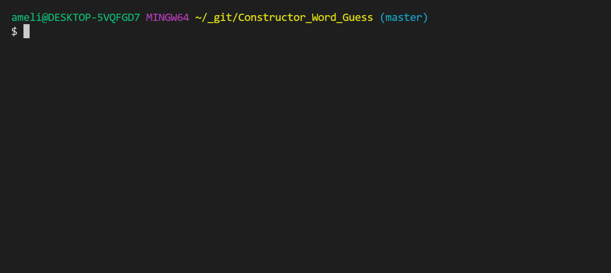

# CLI Word Guessing Game
'CLI Word Guessing Game' is a word guessing game featuring Node.JS and JavaScript constructor functions (Created by Amelia Carlie).

### How to Install
*This CLI application requires Node.JS. If Node.JS is not installed, see this link to install: https://nodejs.org/en/download/.*
1. First, clone the repository to your computer.
2. Then, navigate to the folder in terminal/git bash. Type npm install to install all necessary node.js modules. 

### How to Play
* To start the game, navigate to the folder in terminal/git bash. Type "node index" and hit enter.
* Input your guess and hit enter.
* If your answer is correct, the corresponding blanks will be filled in.
* If your answer is incorrect, your guesses remaining will decrease.
* The game ends when either you solve the puzzle, or you run out of guesses.
* After the game ends, you be prompted to play a new puzzle.